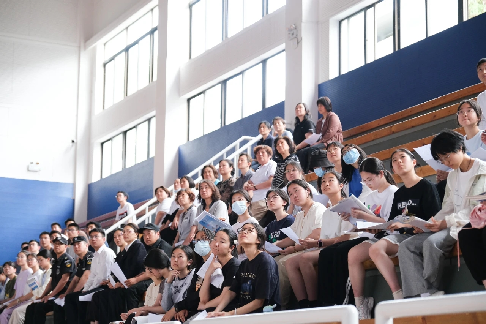
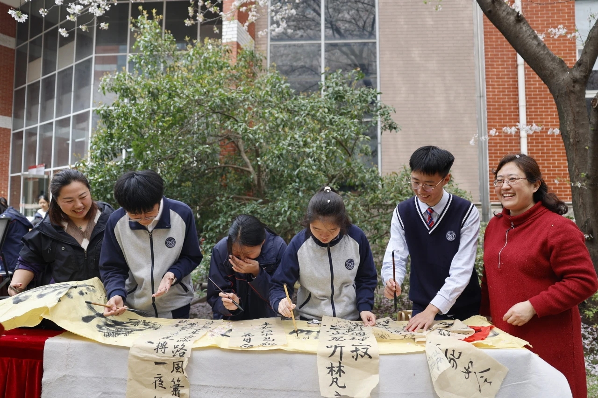
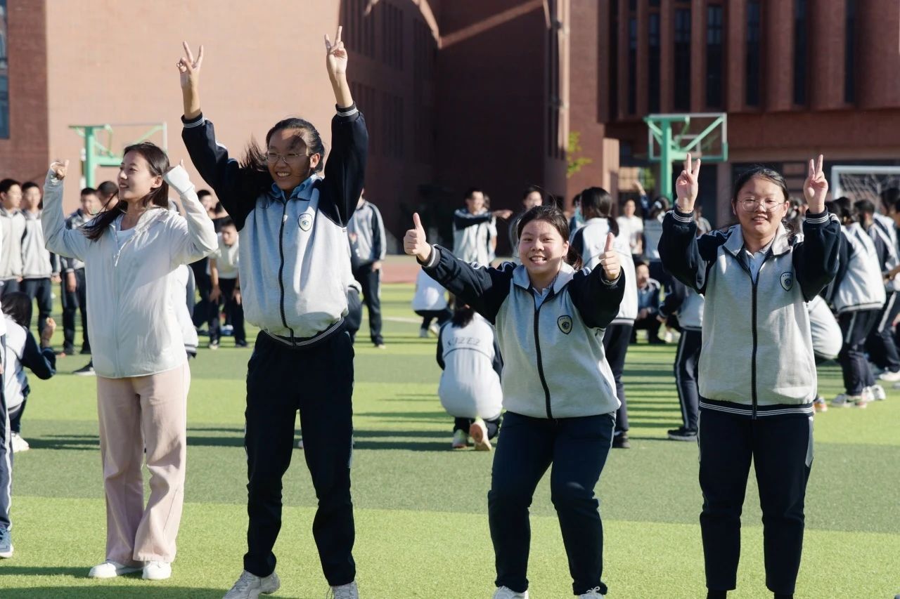
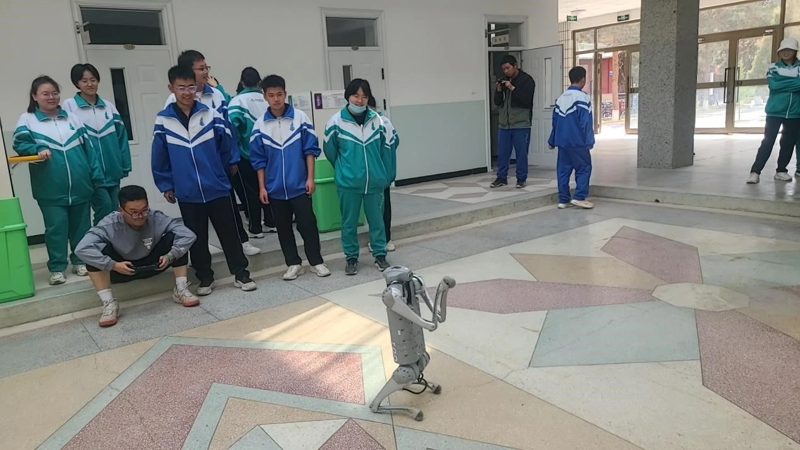
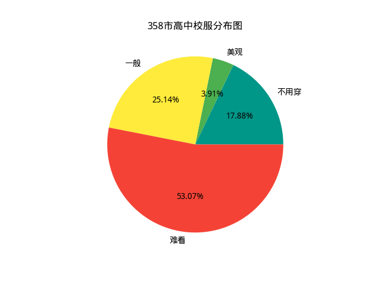
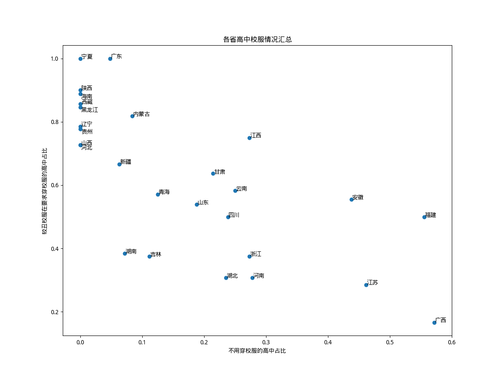
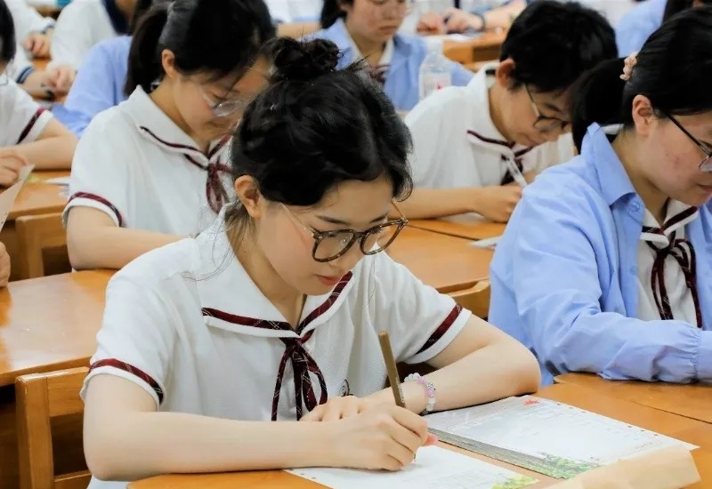
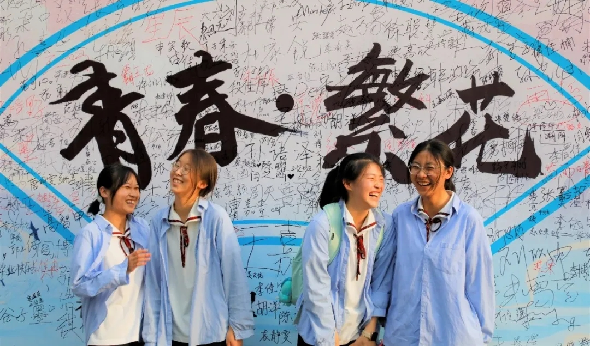
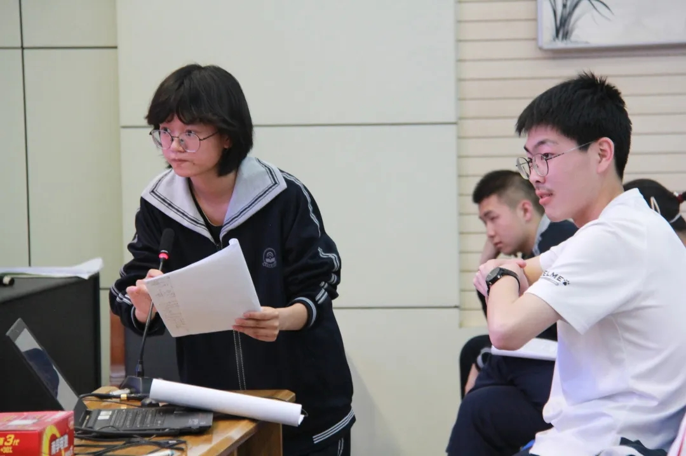
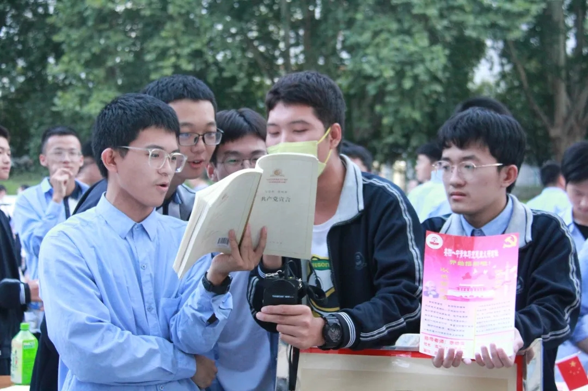

关于中国的高中校服，大部分人总是有着丑陋、肥大的运动装的印象；而如果查看中国的[制服地图](https://uniform.wingzero.tw/school/map/cn)，看到的又普遍都是漂亮的制服。那么实际情况究竟如何呢？我认为，需要根据高中生的日常最常见的穿着，制作校服地图，才能准确地反映出中国的高中校服的现状。

然而根据[教育部的统计](https://news.eol.cn/meeting/202403/t20240301_2560903.shtml)，中国目前有约1.54万所高中；如此浩大的数量，仅凭一人的力量，又如何能统计得过来呢？我决定，仅选择每个地级行政区最具代表性的一所高中。具体的统计方式如下：

- 只统计中国大陆的直辖市、地级行政区和省直辖县级行政单位（下简称“城市”），不包含三沙市及新疆的部分兵团城市；由于使用的地图库echarts自带的`china-cities.json`较为陈旧，在地图的显示中包含了莱芜市等过去的地级市；但是在所有的统计数据中，只包含拥有2022年人均可支配收入数据的358座城市（数据来源：[瑞观世界](https://mp.weixin.qq.com/s/xM97KRqkeV8jiwRgSOOH4Q)；不包含杨陵区）。

- 每座城市选择一所高中，一般是这座城市实力最强的学校。当然，许多时候最强的学校是有所争议的，因此学校选择过程有一定的主观因素。

- 使用公众号等手段，了解这所高中学生的日常穿着；主要参考2024年的最新信息。如果学生全部穿着校服，将统计**日常穿着**的校服的美观度（并不考虑较少穿着的正装校服）；如果学生可以不穿校服，将地图上的这所城市标为青色。美观度属于主观评价，分为三等：

  - 美观的校服：一般是较美观的水手服、棒球服、衬衫等，用绿色表示；
  - 普通的校服：一般是比较普通的运动服款式，用黄色表示；
  - 丑校服：一般为经典蓝白/红白/黑白/绿白等配色的宽大运动服，用红色表示。

  如果四季的校服款式不同，将综合考虑。而校服地图中每所高中只用一张图片来展示，因此可能有些图片更好看的打分反而更低。

  

    
    
不用穿校服：苏州中学

  

  

    
    
美观的校服：天一中学

  

  

    
    
普通的校服：石家庄二中

  

  

    
    
难看校服：酒泉中学

  

# 统计结果

在这358座城市的358所高中里，共有190所的学生需要穿着较丑的校服，占比53%；有90所的学生穿着普通的校服，占比25%；有64所高中可以不穿校服，占比18%；仅有14所高中的学生穿着美观的校服，占比4%.

这几种校服的分布有着明显的地域特点。根据GPT-4o的分析，

- 不用穿校服的高中主要分布在东部和南部地区；
- 美观校服和普通校服主要集中在东部沿海和南方省份。这可能反映了这些地区经济发达，校服设计相对较为现代，受学生欢迎。
- 北方地区校服普遍不受欢迎。这可能与当地文化或设计理念相关。

但这样的分类并不绝对。西北师大附中并不要求穿校服，呼和浩特二中有着美观的校服，而在南方经济发达的广东省，高中生们却普遍穿着丑校服；经济较落后的广西省反而校服较为美观，或者不用穿。

# 与人均可支配收入的相关性

根据GPT-4o的分析，我猜测校服的美观程度与人均可支配收入有关。然而，统计分析否定了这一点。

我使用这358座城市在2022年的人均可支配收入来进行分析。虽然我不懂统计学，但是GPT懂；GPT建议使用Logistic Regression或者Mann-Whitney U检验来分析相关性。由于Mann-Whitney U检验仅需要城市的排名，较为简便，我选择这种方式。

我将要求穿校服的高中分为“校服难看”（即地图里的红色）与“校服不难看”（即黄绿两色）两组，进行检验；统计表明这两组城市的人均可支配收入并不具有显著的差异（$p>0.05$），因此校服的美观程度与人均可支配收入并无显著统计相关性。其余的分组方式，如分为“校服美观”和“校服一般或难看”两组，也并未展现出显著差异。

然而，高中是否要求穿校服却与城市的收入有着显著的相关。要求穿校服的高中，所在城市人均可支配收入排名的平均数约为189；而不要求穿校服的高中，所在城市收入排名平均数约为139。这两组城市之间的Mann-Whitney U检验显示$p=0.0005$，说明人均可支配收入高的城市确实更可能不要求穿校服。

对于省会城市的分析同样验证了这一点。在中国大陆的全部31座直辖市和省会城市中，有9座城市的代表性高中学生不用穿校服，比例约为29%，大于全体城市的18%；而有19座城市的代表性高中要求穿较丑的校服，占61%，这一比例高于全体城市中的53%。

# 省份排行

在获取每个城市的数据之后，我将其按照所属省份进行分类统计。四座直辖市不被计入这些统计：其中北京和天津的高中有着较丑的校服，而上海中学和重庆南开中学不用穿校服。

中国大陆的27个省/自治区中，校服穿着情况有着明显的差异：河北、辽宁、山西、陕西、黑龙江、西藏、宁夏、海南、贵州的全体城市代表高中都需要穿着校服；广东、新疆、湖南、内蒙古、吉林、青海分别只有一所城市的代表高中不用穿校服；而福建、广西两地不用穿校服的高中占了大多数。此外，安徽、江苏两省不用穿校服的高中比例也较高。

而按照难看校服所占的比例来看，广西、江苏两地的难看校服占全体要求穿校服的学校比例最低，河南、湖北、浙江紧随其后。而在广东、宁夏两地，全部要求穿校服的代表性高中，校服都是较丑陋的运动服。在贵州、辽宁、内蒙古、黑龙江、西藏、海南、陕西等地，丑陋校服的比例也占到了压倒性多数。

按照省份这一级来看，不用穿校服的比例较大的省，难看校服占全体校服的比例似乎较小。二者相关系数为$-0.72$。

# 最佳校服

一部分不用穿校服的高中有着很好看的制服，仅在特定活动时要求穿。然而，本部分仅在每日穿校服的高中内筛选，筛选依据是日常穿着而非活动穿着的校服的美观度。根据我的主观判断，安阳一中的校服是其中最为美观的：

  

    
    
女生夏季校服

  

  

    
    
女生夏季校服+衬衫

  

  

    
    
女生冬季校服

  

  

    
    
男生校服

  

值得一提的是，这所高中看上去也拥有丰富的社团与活动，可以说是很颠覆山河四省高中的刻板印象了。

# Trivia

在统计时我还发现了另一些现象：

- 中国的高中基本上都有校服，无论是否要求穿；但也有镇海中学等极少数例外。
- 一些不要求穿校服的学校，似乎大部分学生仍然穿着校服，最典型的例子是深圳中学；反之，一些在公众号里明确要求每日穿着校服的学校，学生的照片却总是不穿校服的。
- 极少数的高中要求女生剪短发，如秦皇岛一中、福州一中、三明一中、鄂尔多斯一中、东北育才学校。佛山市石门中学要求学生统一穿白色回力鞋。
- 攀枝花三中、岳阳市一中、万宁中学的老师也穿校服。
